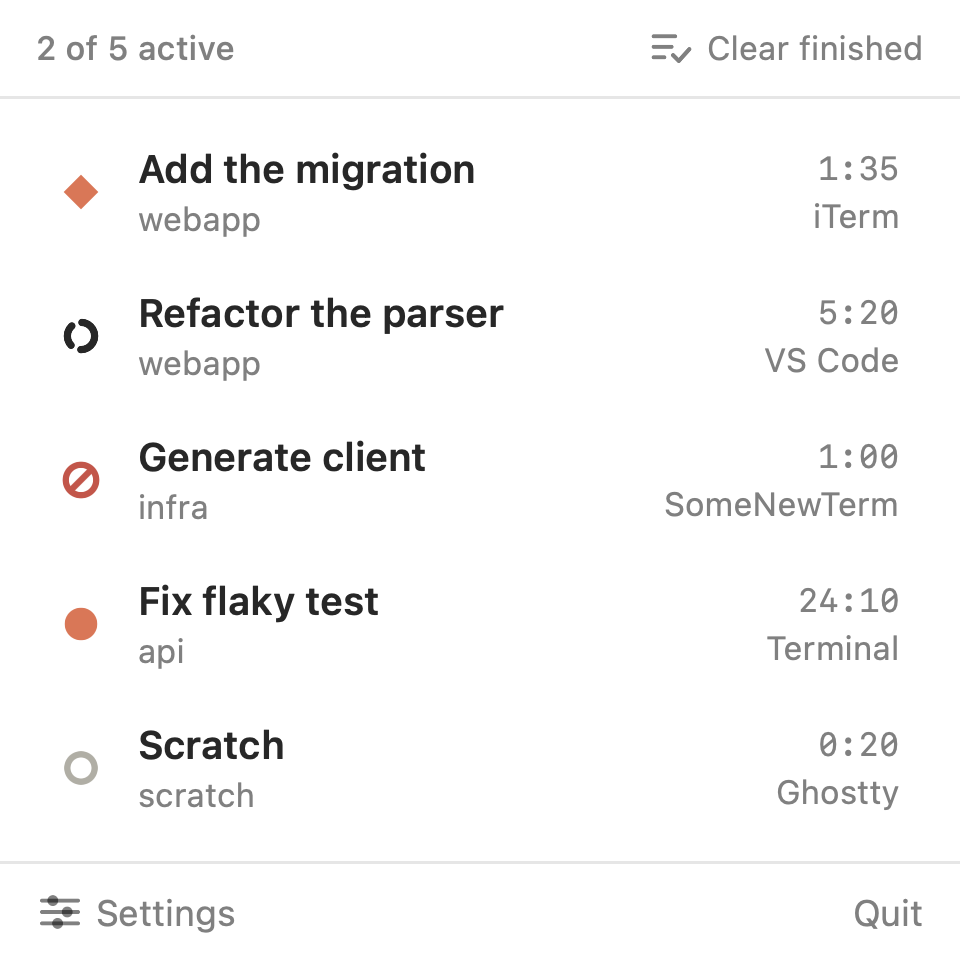

<div align="center">


# Claude Watch

**Is Claude done yet? Now you always know.**

Claude Watch puts every Claude Code session in your macOS menu bar — working, waiting on you, done, or failed — so you never have to alt-tab to check again.

[](#requirements)
[](#requirements)
[](LICENSE)
[](#)
[](https://github.com/sbalagan22/claude-watch/stargazers)

**[⬇ Download the latest .dmg](https://github.com/sbalagan22/claude-watch/releases/latest)** · [Website](https://claudewatch.app) · [Changelog](https://claudewatch.app/changelog)

</div>

---

### ⭐ If Claude Watch saves you an alt-tab, consider starring the repo

It's free and always will be — a star is the only "thank you" this project asks for, and it's the main way other Claude Code users find it.

---

## Why

Claude Code runs in your terminal or your IDE. It can take seconds or minutes to finish a turn, and it sometimes stops to ask you something. Without Claude Watch, the only way to know is to keep switching back to check — or wait for a sound that might be muted, in a window that might be buried under six others.

Claude Watch answers one question, always visible, at a glance: **is Claude done yet?**

## What it looks like

<div align="center">

</div>

Click the menu bar icon for the full picture: every Claude Code session, by chat name and project folder, with its live state. Click a row and it jumps straight to that exact terminal tab or IDE window — however many you have open.

## Five states, one glyph

| State | What it means |
|---|---|
| **Idle** | Nothing running. The mark sits still, in the bar's own colour. |
| **Working** | A turn is in progress. The mark turns, a quarter every couple of seconds. |
| **Needs you** | A permission prompt or a question is waiting. Orange, breathing, until you answer. |
| **Done** | A turn finished while you were elsewhere. It pulses orange, hard, until you look. |
| **Failed** | A turn ended on an error. Red, one spike broken, and it does not move. |

You learn the whole interface in about a minute.

## Features

- 🟠 **Live menu bar status** for every running Claude Code session, animated with almost no CPU cost.
- 📋 **One panel, every session** — chat name, project folder, elapsed time, and whether it's in a terminal or an IDE.
- 🖱️ **Click to jump** straight to the exact tab, pane, or window: iTerm2, Terminal, kitty, WezTerm, and IDE windows by title.
- 🔔 **Optional sound** when a turn finishes, and optional status text beside the glyph — both can be switched off.
- ⚡ **Zero-poll architecture** — a file-system watcher reacts to Claude Code's own hook events instead of checking on a timer. Idle CPU is 0.0%.
- 🔒 **No network access, no account, no telemetry.** Session state lives in `~/Library/Application Support/claude_watch/` and is deleted the moment a session ends.
- 🧩 **Self-installing hooks.** On first launch it merges its handlers into your existing `~/.claude/settings.json` — nothing is overwritten, and it's fully reversible.
- ♿ **Reduce Motion aware.** Every animated state has a designed static frame.
- 💻 **Universal binary.** Apple silicon and Intel, macOS 14 (Sonoma) or later.

## Install

**[Download the latest release →](https://github.com/sbalagan22/claude-watch/releases/latest)**

1. Open the `.dmg` and drag **Claude Watch** to Applications.
2. Launch it. On first run it installs its Claude Code hooks for you, merging into your existing settings — nothing is overwritten.
3. Run Claude Code as usual. The menu bar icon comes alive on the next session event.

### Build from source

Requires [XcodeGen](https://github.com/yonaskolb/XcodeGen) (`brew install xcodegen`).

```sh
git clone https://github.com/sbalagan22/claude-watch.git
cd claude-watch
make build          # release build, universal
make run            # build and launch
make install-hooks  # merge the hook config into ~/.claude/settings.json
```

Other useful targets:

```sh
make test           # hook bridge + installer + unit tests
make uninstall-hooks # remove only Claude Watch's own hook handlers
make idle-cpu        # measure idle CPU of a running instance
```

The `.xcodeproj` is generated from `project.yml` and is not checked in.

## Requirements

- macOS 14 Sonoma or later
- Apple silicon or Intel
- [Claude Code](https://claude.com/claude-code) installed

## How it works

Claude Code emits hook events. `make install-hooks` merges a small set of handlers into `~/.claude/settings.json` and installs a status writer script into `~/Library/Application Support/claude_watch/`.

Every hook runs the same script with the event name as an argument. The script reads the hook JSON from stdin and writes one file per session into `.../claude_watch/sessions/<session_id>.json`. The app watches that directory with a `DispatchSource` file-system event source — it never polls — and renders whatever it finds.

| Event | State |
|---|---|
| `SessionStart` | `idle` |
| `UserPromptSubmit` | `working` |
| `Stop`, `SubagentStop` | `done` |
| `StopFailure` | `failed`, with the reason kept |
| `Notification` | `needs_you` (`agent_completed` means `done`) |
| `SessionEnd` | entry removed |

Entries are created lazily on **any** event, not only on `SessionStart`, so a session that was already running when you installed the hooks appears on its next event.

### Safety

The status writer sits on Claude Code's hook path, so three things are load-bearing:

1. **It exits 0 on every path.** Exit code 2 from a `Stop` hook prevents Claude from stopping; a non-zero exit from `UserPromptSubmit` erases your prompt. The whole script body runs inside a wrapper that cannot propagate a failure, and the file ends in a bare `exit 0`. A test injects a hard failure mid-script and asserts the exit status is still 0.
2. **Handlers are registered `async`** wherever the event supports it, so the writer never sits in the agent's critical path. `SessionEnd` is the exception: it does not support async and shares a 1.5 second budget across all handlers, so its code path is a single `unlink`.
3. **The installer merges, it does not overwrite.** Your existing hooks are preserved; re-running is idempotent; `make uninstall-hooks` removes only Claude Watch's own handlers. Settings are backed up before every write, and an unparseable settings file is left untouched.

### Liveness

The writer records the owning Claude Code PID. The app checks `kill(pid, 0)` on a slow timer and on every panel open, so a session whose process is gone disappears immediately rather than spinning forever. Crashed sessions never fire `SessionEnd`, so orphan files are also pruned on launch. Time-based staleness is kept only as a backstop against a recycled PID.

### Energy

Idle CPU is 0.0%: when nothing is animating, the animation timer is invalidated rather than left ticking. While animating, the frame rate is capped at 12fps (~3% CPU). Animation suspends under Reduce Motion, display sleep, a hidden menu bar, and low battery. Several working sessions show a count badge rather than animating faster.

## Layout

```
Sources/ClaudeWatch/
  App/        entry point, LSUIElement app delegate
  Core/       session store actor, file watcher, liveness, paths, installer bridge
  MenuBar/    NSStatusItem controller, animated icon, energy gate
  Panel/      popover contents, rows, settings
  Design/     Colors, Typography, Metrics — the only place literals live
  Models/     Session, environment detection
Resources/    the hook status writer script, Info.plist, entitlements
Scripts/      installer and test suites
```

`DECISIONS.md` records the choices made along the way and why.

## Contributing

Issues and pull requests are welcome. If you're proposing a larger change, open an issue first so we can talk through the approach — `DECISIONS.md` has the reasoning behind most of the existing design choices and is worth a skim.

```sh
make test   # run before opening a PR
```

## License

[MIT](LICENSE) — do what you want with it.

---

<div align="center">

Not affiliated with Anthropic. Claude and Claude Code are trademarks of Anthropic, PBC.

If Claude Watch is useful, **[⭐ star it on GitHub](https://github.com/sbalagan22/claude-watch)** — it genuinely helps.

</div>
